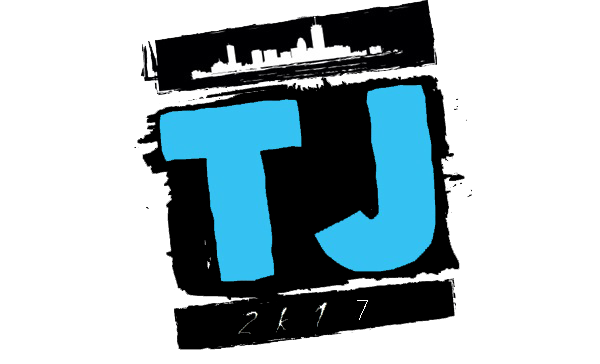
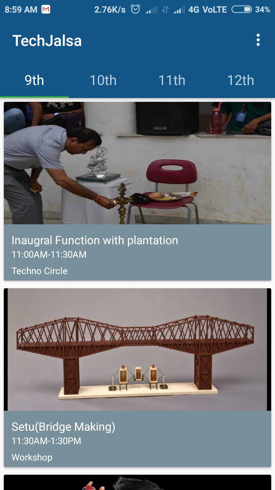
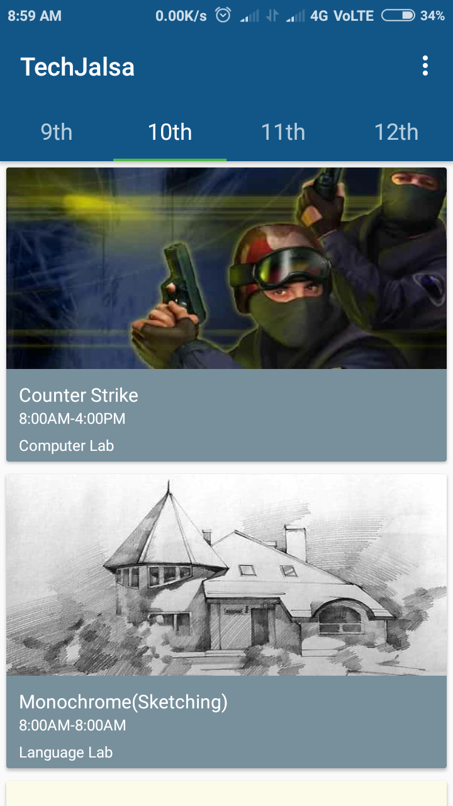
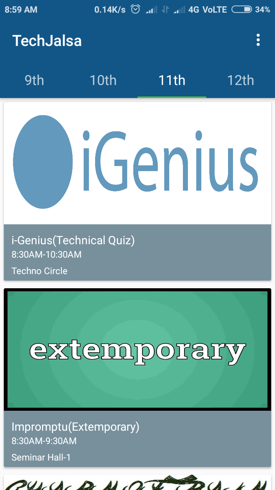
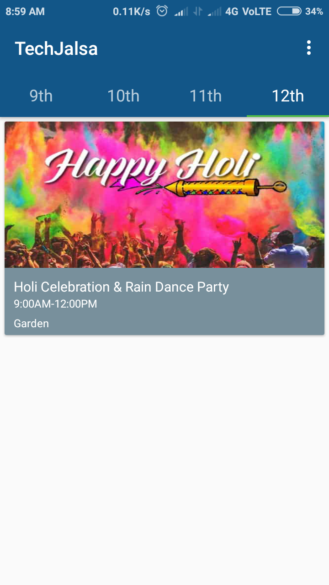
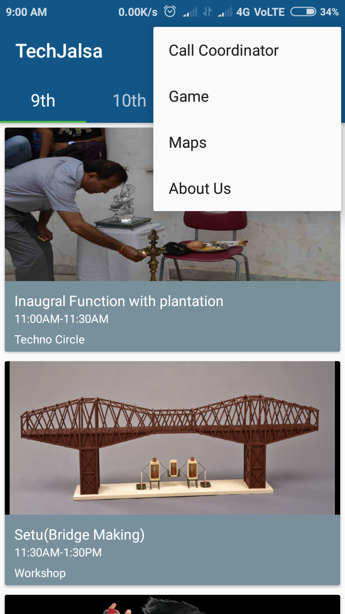
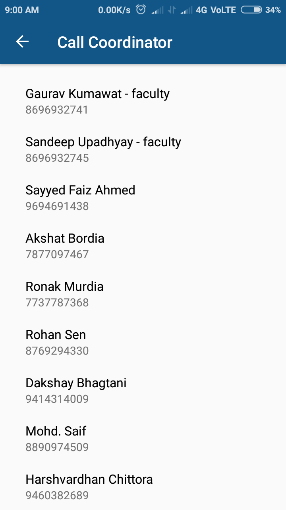
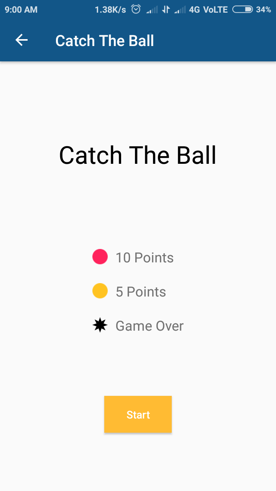
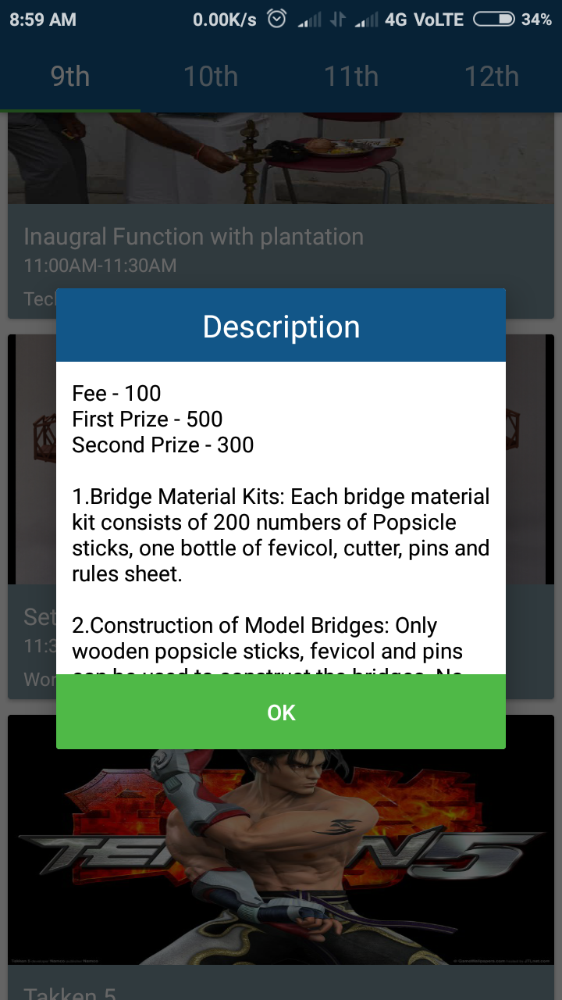
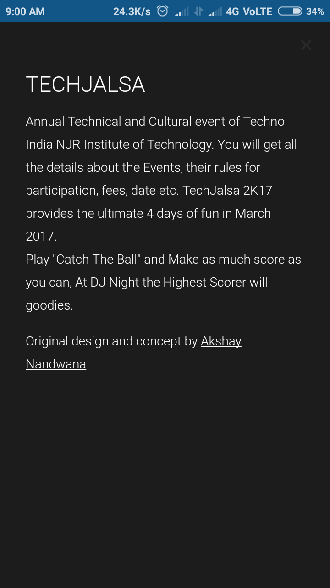

# Tech-Jalsa

 

### What is Tech-Jalsa
Tech Jalsa is the annual Technical and Cultural event of Techno India NJR Institute of Technology.
The moment to put the course books aside and swinging back into our fun-modes. *TechJalsa 2K17* the inter university technical festival. Ranging from bridge-making to face-painting, from extempore to paper presentations, from fashion show to roadies, TechJalsa 2K17 provides the ultimate 4 days of fun in March 2017.

### What is Tech-Jalsa Android Application
- An Android app for Techno India NJR students to keep track of 2017 fest events
- App contains Firebase notification feature to give students updates about events
- 70 students of college downloaded the app
- App includes **Catch The Ball** game by [codingwithsara](https://www.youtube.com/playlist?list=PLRdMAPi4QUfbIg6dRXf56cbMfeYtTdNSA)

### Screenshots

   

   

 

	
	
## Release History

* 0.0.1
    * Work in progress

## Meta

Akshay Nandwana – [@akshay81844](https://twitter.com/akshay81844) – akshaynandwana001@gmail.com

Distributed under the MIT LICENSE license. See [``LICENSE``](https://github.com/anandwana001/Tech-Jalsa/blob/master/LICENSE) for more information.

### If you like the project give a star [:star:](https://github.com/anandwana001/Tech-Jalsa/stargazers)
